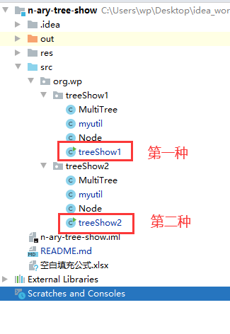

# 目前的问题
## 第一个问题（已经解决）
必须按图的顺序 从上往下输入节点 的路径

`->` 的左侧一定要在之前出现过，不然会失效

```java
public class myutil {
    private List<String> inputList_to_okList(List<String> inputList){}
}
```

## 第二个问题
居中显示和箭头的问题

- 第一种改进：考虑整体布局的情况下将各行居中显示，改变箭头的位置。
- 第一种改进：显示的结果需要考虑到同级的框，上下层的框和整体的布局。

# 使用方法


## 第一种结果
打印结果：
```
root->root
----
root->aa
----
aa->yy
aa->bb
aa->gg
----
yy->zz
bb->cc
bb->ee
bb->ff
----
cc->qq
cc->dd
ff->jjjj
----
------------
     +                                                        
     |                                                        
  ╔══════╗                                                    
  ║  aa  ║                                                    
  ╚══════╝                                                    
     +         ╮    -------------------------------------╮    
     |         |                                         |    
  ╔══════╗  ╔══════╗                                  ╔══════╗
  ║  yy  ║  ║  bb  ║                                  ║  gg  ║
  ╚══════╝  ╚══════╝                                  ╚══════╝
     +         +    ---------------╮    -----╮              
     |         |                   |         |              
  ╔══════╗  ╔══════╗            ╔══════╗  ╔══════╗          
  ║  zz  ║  ║  cc  ║            ║  ee  ║  ║  ff  ║          
  ╚══════╝  ╚══════╝            ╚══════╝  ╚══════╝          
               +         ╮                   +                
               |         |                   |                
            ╔══════╗  ╔══════╗            ╔════════╗          
            ║  qq  ║  ║  dd  ║            ║  jjjj  ║          
            ╚══════╝  ╚══════╝            ╚════════╝          

Process finished with exit code 0

```

## 第二种结果
打印结果：
```
root->root
----
root->o
----
o->aa
----
aa->xoop
aa->bbb
----
xoop->xxxx
bbb->c
bbb->g
bbb->ff
----
c->k
c->d
g->xhh
ff->e
ff->t
----
d->h
----
root->root 坐标信息:(行,列) (0,0)  父节点的坐标信息:(行,列) (0,0)  子节点的第一个位置(列):0 子节点的个数:1 这行一共有元素个数：1
root->o 坐标信息:(行,列) (1,0)  父节点的坐标信息:(行,列) (0,0)  子节点的第一个位置(列):0 子节点的个数:1 这行一共有元素个数：1
o->aa 坐标信息:(行,列) (2,0)  父节点的坐标信息:(行,列) (1,0)  子节点的第一个位置(列):0 子节点的个数:2 这行一共有元素个数：1
aa->xoop 坐标信息:(行,列) (3,0)  父节点的坐标信息:(行,列) (2,0)  子节点的第一个位置(列):0 子节点的个数:1 这行一共有元素个数：2
aa->bbb 坐标信息:(行,列) (3,1)  父节点的坐标信息:(行,列) (2,0)  子节点的第一个位置(列):1 子节点的个数:3 这行一共有元素个数：2
xoop->xxxx 坐标信息:(行,列) (4,0)  父节点的坐标信息:(行,列) (3,0)  子节点的第一个位置(列):-1 子节点的个数:0 这行一共有元素个数：4
bbb->c 坐标信息:(行,列) (4,1)  父节点的坐标信息:(行,列) (3,1)  子节点的第一个位置(列):0 子节点的个数:2 这行一共有元素个数：4
bbb->g 坐标信息:(行,列) (4,2)  父节点的坐标信息:(行,列) (3,1)  子节点的第一个位置(列):2 子节点的个数:1 这行一共有元素个数：4
bbb->ff 坐标信息:(行,列) (4,3)  父节点的坐标信息:(行,列) (3,1)  子节点的第一个位置(列):3 子节点的个数:2 这行一共有元素个数：4
c->k 坐标信息:(行,列) (5,0)  父节点的坐标信息:(行,列) (4,1)  子节点的第一个位置(列):-1 子节点的个数:0 这行一共有元素个数：5
c->d 坐标信息:(行,列) (5,1)  父节点的坐标信息:(行,列) (4,1)  子节点的第一个位置(列):0 子节点的个数:1 这行一共有元素个数：5
g->xhh 坐标信息:(行,列) (5,2)  父节点的坐标信息:(行,列) (4,2)  子节点的第一个位置(列):-1 子节点的个数:0 这行一共有元素个数：5
ff->e 坐标信息:(行,列) (5,3)  父节点的坐标信息:(行,列) (4,3)  子节点的第一个位置(列):-1 子节点的个数:0 这行一共有元素个数：5
ff->t 坐标信息:(行,列) (5,4)  父节点的坐标信息:(行,列) (4,3)  子节点的第一个位置(列):-1 子节点的个数:0 这行一共有元素个数：5
d->h 坐标信息:(行,列) (6,0)  父节点的坐标信息:(行,列) (5,1)  子节点的第一个位置(列):-1 子节点的个数:0 这行一共有元素个数：1


╔════════╗
║  root  ║
╚════════╝
╔═════╗
║  o  ║
╚═════╝
╔══════╗
║  aa  ║
╚══════╝
╔════════╗   ╔═══════╗
║  xoop  ║   ║  bbb  ║
╚════════╝   ╚═══════╝
╔════════╗   ╔═════╗   ╔═════╗   ╔══════╗
║  xxxx  ║   ║  c  ║   ║  g  ║   ║  ff  ║
╚════════╝   ╚═════╝   ╚═════╝   ╚══════╝
╔═════╗   ╔═════╗   ╔═══════╗   ╔═════╗   ╔═════╗
║  k  ║   ║  d  ║   ║  xhh  ║   ║  e  ║   ║  t  ║
╚═════╝   ╚═════╝   ╚═══════╝   ╚═════╝   ╚═════╝
╔═════╗
║  h  ║
╚═════╝

```

